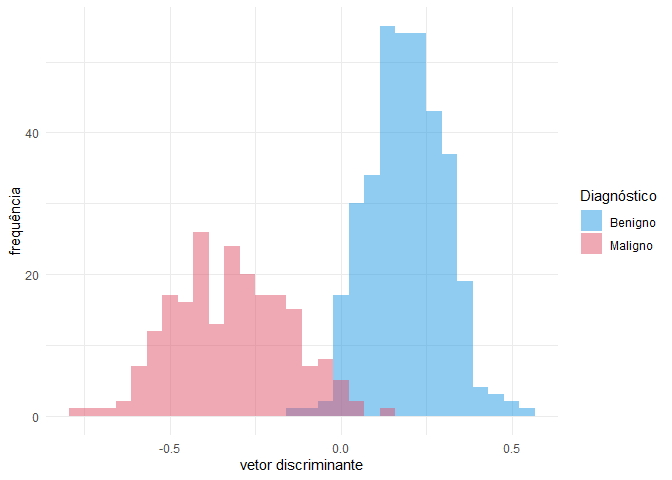

<!-- README.md is generated from README.Rmd. Please edit that file -->

# Fisher-classifier-api

<!-- badges: start -->
<!-- badges: end -->

Análise discriminante de Fisher consiste na projeção dos dados em poucos
vetores, de forma a “maximizar a separabilidade” das classes envolvidas
em um subespaço de baixa dimensionalidade.

`Fisher_classifier-api` é uma API com o deploy de um modelo de
aprendizado supervisionado de máquina construído from scratch, o
classificador de Fisher, treinado no famoso Breast Cancer Wisconsin
Diagnostic Data Set, retirado do repositório de aprendizado de máquina
da University of California Irvine
\[<https://doi.org/10.24432/C5DW2B>\]. A API fornece endpoints de
predição de novas observações e de diagnóstico do classificador, de
maneira a facilitar e simplificar o acesso ao modelo e a integração com
diferentes sistemas/plataformas.

<h2>
🚀 Getting started
</h2>
<h3>
Estrutura do banco de dados
</h3>

O conjunto de dados é composto por 31 colunas, desta sendo uma variável
resposta: o diagnóstico do tumor

- `diagnosis:` variável categórica com duas categorias: B e M, indicando
  (com a respectiva letra inicial) se o tumor é benigno ou maligno.

Para além disso, as outras 30 colunas são todas numéricas, e indicam
características observadas nos núcleos celulares das massas mamárias.

<h3>
Pré-requisitos
</h3>

Você precisará do gerenciador de dependências `renv` instalado

``` bash
install.packages("renv")
```

<h3>
Clonando
</h3>

``` bash
git clone https://github.com/felipecamilo/fisher-classifier-api
```

<h2>
📍 API Endpoints
</h2>

| rota                                      | descrição                                                        |
|-------------------------------------------|------------------------------------------------------------------|
| <kbd>POST /predict</kbd>                  | prevê o diagnóstico de uma ou mais amostras (benigno ou maligno) |
| <kbd>GET /model-info</kbd>                | retorna informações sobre o modelo                               |
| <kbd>GET /generate-synthetic-sample</kbd> | gera uma amostra sintética (SMOTE)                               |
| <kbd>GET /history</kbd>                   | retorna o histórico de predições realizadas                      |

<h3>
POST /predict
</h3>

**REQUISIÇÃO**

``` bash
[
  {"radius_mean": 18.0201,"texture_mean": 20.9972,"perimeter_mean": 115.9262,"area_mean": 1004.6563,"smoothness_mean": 0.0785,"compactness_mean": 0.0776,"concavity_mean": 0.0931,"concave.points_mean": 0.0569,"symmetry_mean": 0.1935,"fractal_dimension_mean": 0.0519,"radius_se": 0.5968,"texture_se": 1.2631,"perimeter_se": 3.8722,"area_se": 66.0802,"smoothness_se": 0.0048,"compactness_se": 0.0324,"concavity_se": 0.0435,"concave.points_se": 0.0123,"symmetry_se": 0.0346,"fractal_dimension_se": 0.0036,"radius_worst": 20.1377,"texture_worst": 26.1416,"perimeter_worst": 129.1461,"area_worst": 1243.1986,"smoothness_worst": 0.097,"compactness_worst": 0.1613,"concavity_worst": 0.2403,"concave.points_worst": 0.1041,"symmetry_worst": 0.3526,"fractal_dimension_worst": 0.0635},
  {"radius_mean": 11.4303,"texture_mean": 16.8181,"perimeter_mean": 72.9406,"area_mean": 399.1871,"smoothness_mean": 0.0951,"compactness_mean": 0.0668,"concavity_mean": 0.0311,"concave.points_mean": 0.0241,"symmetry_mean": 0.1724,"fractal_dimension_mean": 0.0632,"radius_se": 0.1928,"texture_se": 0.8374,"perimeter_se": 1.2125,"area_se": 14.0645,"smoothness_se": 0.009,"compactness_se": 0.0109,"concavity_se": 0.0129,"concave.points_se": 0.0078,"symmetry_se": 0.0196,"fractal_dimension_se": 0.0025,"radius_worst": 12.4978,"texture_worst": 21.4743,"perimeter_worst": 79.5112,"area_worst": 476.6553,"smoothness_worst": 0.1516,"compactness_worst": 0.1259,"concavity_worst": 0.1178,"concave.points_worst": 0.0716,"symmetry_worst": 0.2915,"fractal_dimension_worst": 0.0816}
]
```

**RESPOSTA**

``` bash
["B","M"]
```

<h3>
GET /model-info
</h3>

**RESPOTA**

``` bash
{
  "n_final_model": [
    569
  ],
  "accuracy": [
    0.9596
  ],
  "confusion_matrix": [
    {
      "Prediction": "B",
      "Reference": "B",
      "Freq": 355
    },
    {
      "Prediction": "M",
      "Reference": "B",
      "Freq": 2
    },
    {
      "Prediction": "B",
      "Reference": "M",
      "Freq": 21
    },
    {
      "Prediction": "M",
      "Reference": "M",
      "Freq": 191
    }
  ]
}
```

<h3>
GET /generate-synthetic-sample
</h3>

**RESPOTA**

``` bash
[
  {"radius_mean": 8.0414, "texture_mean": 22.1856, "perimeter_mean": 51.2003, "area_mean": 195.0407, "smoothness_mean": 0.078, "compactness_mean": 0.0969, "concavity_mean": 0.081, "concave.points_mean": 0.0133, "symmetry_mean": 0.1976, "fractal_dimension_mean": 0.0734, "radius_se": 0.2679, "texture_se": 1.7554, "perimeter_se": 1.7479, "area_se": 13.6686, "smoothness_se": 0.0104, "compactness_se": 0.035, "concavity_se": 0.0475, "concave.points_se": 0.0063, "symmetry_se": 0.0245, "fractal_dimension_se": 0.0083, "radius_worst": 9.2328, "texture_worst": 29.9715, "perimeter_worst": 58.4978, "area_worst": 257.0731,  "smoothness_worst": 0.1347, "compactness_worst": 0.2892, "concavity_worst": 0.3299, "concave.points_worst": 0.0483, "symmetry_worst": 0.3148, "fractal_dimension_worst": 0.1183}
]
```

<h3>
GET /history
</h3>

**RESPOTA**

``` bash
[
  {"prediction": "B","X1": 11.4303,"X2": 16.8181,"X3": 72.9406,"X4": 399.1871,"X5": 0.0951,"X6": 0.0668,"X7": 0.0311,"X8": 0.0241,"X9": 0.1724,"X10": 0.0632,"X11": 0.1928,"X12": 0.8374,"X13": 1.2125,"X14": 14.0645,"X15": 0.009,"X16": 0.0109,"X17": 0.0129,"X18": 0.0078,"X19": 0.0196,"X20": 0.0025,"X21": 12.4978,"X22": 21.4743,"X23": 79.5112,"X24": 476.6553,"X25": 0.1516,"X26": 0.1259,"X27": 0.1178,"X28": 0.0716,"X29": 0.2915,"X30": 0.081}
]
```

<h2>
📚 Matemática por trás
</h2>

A análise discriminante de Fisher (ADF) é um método clássico de
`separação` de classes, neste modelo a ideia para separar os dados é
projetá-los em uma nova base ortonormal de componentes (vetores)
discriminantes, obtida de tal forma que a sua direção é a que ao mesmo
tempo maximiza a variância entre classes, minimizando a variância intra
classes. É possível mostrar que a estimativa das componentes que melhor
discriminam os dados de acordo com o critério establecido são os
autovetores com autovalores não-nulos da matriz:

$$\mathbf{W}^{-1}\mathbf{B}
$$

onde $\mathbf{W}$ é a soma em todas as g classes
$`\sum_{i = 1}^g(n_i-1)\mathbf{S}_i`$ e
$`\mathbf{B}= \sum_{i = 1}^gn_i(\mathbf{\bar{x}}_i-\mathbf{\bar{x}})(\mathbf{\bar{x}}_i-\mathbf{\bar{x}})^T`$
sendo $\mathbf{S}_i$, $\mathbf{\bar{x}}_i$ e $n_i$ a matriz de
covariância amostral, o vetor de médias amostral e quantidade de
amostras, todos na classe $i$, respectivamente.

Se $p$ é o número de variáveis numéricas dos dados e $g$ a quantidade de
classes, O número máximo de vetores com autovalor não-nulo é o
$min(p,g-1)$, por isso os dados são geralmente projetados em subespaços
de baixa dimensionalidade; no caso de menos que 4 dimensões podemos
visualizar todo o subespaço e até mesmo classificar novas observações a
olho!

ADF é não paramétrica, porém assume a igualdade das matrizes de
covariância entre as classes, pressuposto esse que possui certa robustez
(como no nosso caso). Ainda assim é fundamental que as classes sejam
linearmente separáveis, caso contrário o método perde o sentido e
deve-se buscar alternativas como a variação por kernel.

No nosso modelo com Breast Cancer Wisconsin Diagnostic Data Set temos
duas classes e portanto somente uma componente discriminante,
permitindo-nos visualizar a projeção dos dados em um histograma
unidimensional:

<!-- -->

Com os dados separados dessa forma, `classificar` novas observações fica
fácil até mesmo manualmente! Se você tem interesse em se aprofundar mais
no assunto, recomendo o livro de Johnson e Wichern,
`Applied Multivariate Statistical Analysis`, que utilizei como
referência.

<h2>
🤝 Contribua
</h2>

Sinta-se livre para colaborar com issues, pull requests, e indicações de
melhoria !!
